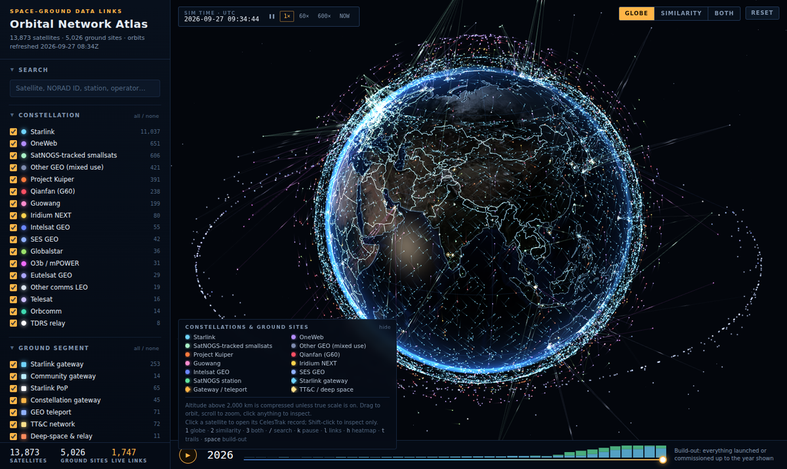

# Orbital Network Atlas

A live 3D atlas of **satellite-to-ground-station data links**. It shows 13,873 networking
satellites, positioned from today's public orbital elements, and 5,026 ground sites:
gateways, teleports, tracking-and-control stations and the SatNOGS open network. Animated
beams show which satellites each site can see right now. The atlas also has a similarity
map (a "datamap") of the whole dataset, a coverage heatmap and a timeline of how the network
was built out. It installs as a **progressive web app (PWA)** and works offline once loaded.

**Open it:** https://bobroberts2639.github.io/Pangolin-Orbital-Network-Atlas-datamap-with-pwa/




## What you can do

- **Globe:** satellites move in real time, or at 60× or 600× speed. Links are drawn from each
  online ground site to the satellites above its elevation mask. Country borders stay
  readable at full-globe zoom.
- **Click a satellite** to open its **CelesTrak** catalogue record. Ground sites open their
  **FCC filing**, or their source page if they have none. Shift-click selects without
  opening anything.
- **Selecting a satellite** draws its orbit, its ground track (one orbit back and one
  forward) and its 25° visibility footprint. The inspector lists its live links.
- **Coverage heatmap** (`h`): shades each point on Earth by how many of the shown satellites
  are above 25° elevation there right now. Hover the globe for the exact count.
- **Motion trails** (`t`), a modelled **Starlink laser mesh**, and a **true-scale altitude**
  option.
- **Similarity map:** every satellite and ground site laid out with UMAP and clustered with
  HDBSCAN, with hand-written labels at three zoom levels.
- **Filters:** constellation, ground-segment type, launch or commissioning year, altitude,
  orbit class and status. There are also filters for sites with FCC filings and sites
  operating under temporary authority.
- **Build-out timeline:** play it to watch the constellations and the ground network grow.

Touch: one finger rotates or pans, two fingers pinch to zoom; the `+`/`−` buttons also zoom.

Keys: `1` globe · `2` similarity · `3` both · `/` search · `k` pause clock · `l` links ·
`h` heatmap · `t` trails · `space` build-out · `+`/`-` zoom · `r` reset.

## Install as an app

The site is a PWA with a web manifest, a service worker and icons.

- **Desktop Chrome or Edge:** use the **Install** button in the top bar, or the install icon
  in the address bar.
- **Android:** use the browser menu, then **Install app**.
- **iPhone or iPad:** in Safari, tap **Share**, then **Add to Home Screen**.

The app shell, textures and data are cached on first load. `data/orbital.json` is fetched
network-first, so each day's refresh shows up and the last copy is used when offline.

## Repository layout

| Path | What it is |
|---|---|
| `index.html` | The whole app (three.js globe + canvas similarity map). No build step. |
| `manifest.webmanifest`, `sw.js`, `icons/` | PWA manifest, service worker, icon set (normal + maskable) |
| `data/orbital.json` | Satellites, ground sites, similarity layout and labels (about 4 MB) |
| `data/borders.json` | Country outlines for the globe |
| `data/fcc/` | The FCC filing list, tagged, plus the raw temporary-authority pull |
| `assets/` | Earth textures and `three.min.js` (served locally so the app works offline) |
| `pipeline/` | Rebuild scripts plus every input they need |
| `notebooks/orbital_network_atlas.ipynb` | Narrated write-up of how the atlas was built, with figures |
| `qr/` | QR code to the hosted app (PNG + SVG) |
| `DATA.md` | Provenance, method, validation numbers and known gaps. **Read before publishing.** |
| `.github/workflows/refresh.yml` | Daily orbit refresh (GitHub Action) |

## Hosting on GitHub Pages

1. Push this repository to `main`.
2. In the repository **Settings**, open **Pages**. Under **Build and deployment**, choose
   **Deploy from a branch**, then `main` and `/ (root)`.
3. The app is served at the URL above within a minute or two. `.nojekyll` is included so
   every file is served as-is.
4. In **Settings**, open **Actions**, then **General**. Allow **Read and write permissions**
   for workflows, so the daily refresh can commit.

## Daily refresh

`.github/workflows/refresh.yml` runs every day at 11:48 UTC. You can also run it from
**Actions**: open **Daily orbit refresh** and click **Run workflow**. Each run:

1. Downloads fresh CelesTrak elements and the SATCAT catalogue (via GitHub mirrors), plus
   the Starlink PoP list.
2. Rebuilds the master table.
3. Re-fits every orbit with SGP4 to the current hour.
4. Commits `data/orbital.json` if it changed.

It refuses to commit a payload with fewer than 10,000 satellites or 4,000 stations.
Satellites launched since the similarity layout was computed are placed next to their
nearest neighbours in feature space.

Run it locally:

```bash
cd pipeline
pip install numpy sgp4
python refresh.py          # writes out/orbital.json
cp out/orbital.json ../data/orbital.json
```

Serve locally with `python -m http.server 8000` from the repository root. Browsers block
`fetch` on `file://`, so opening `index.html` directly won't load the data.

## Accuracy, briefly

- **Satellite positions:** median about 10 km against full SGP4 at the refresh time. The
  error grows over the following days.
- **Beams:** a geometric model of which satellites each site can see, not observed traffic.
- **Ground-site locations:** most are exact. Some are town-level or reported only. The
  inspector says which basis each site uses.

The details are in `DATA.md`.

## Sources and credits

- **Orbital elements and catalogue:** CelesTrak (Dr T.S. Kelso), via GitHub mirrors
  `satvisorcom/satvisor-data` and `2048lr/celestrak-mirror`.
- **SatNOGS ground stations:** Libre Space Foundation (ODbL).
- **Starlink PoPs and community gateways:** `clarkzjw/starlink-geoip-data` (University of
  Victoria).
- **Starlink gateway list:** starlinkinsider.com (compiled from FCC filings).
- **FCC Form 312 Schedule B data:** FCC ICFS, a US public record.
- **Earth imagery:** NASA Blue Marble and Black Marble.
- **Country borders:** `johan/world.geo.json`.
- **Geocoding:** GeoNames (CC-BY 4.0).
- **3D rendering:** three.js (MIT).
